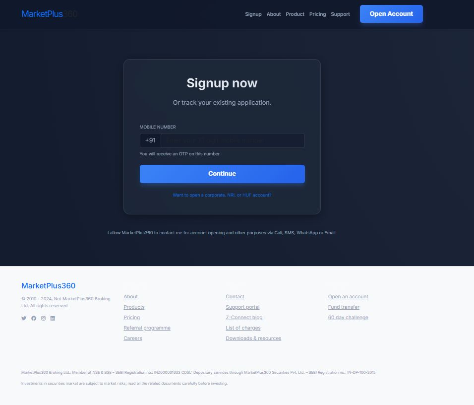
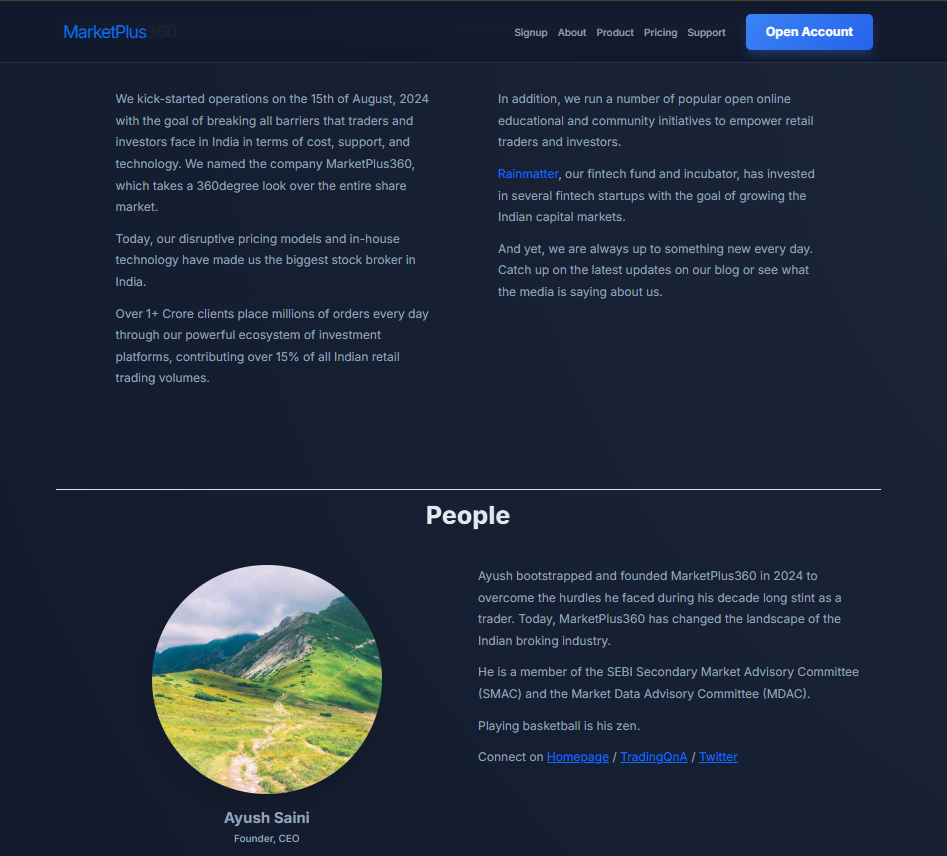
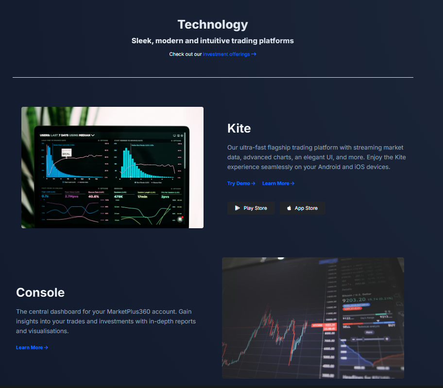
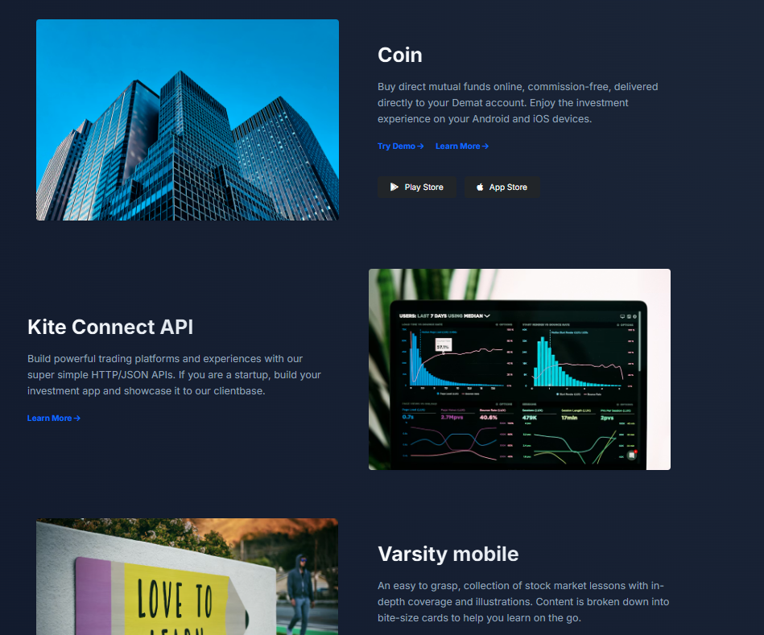
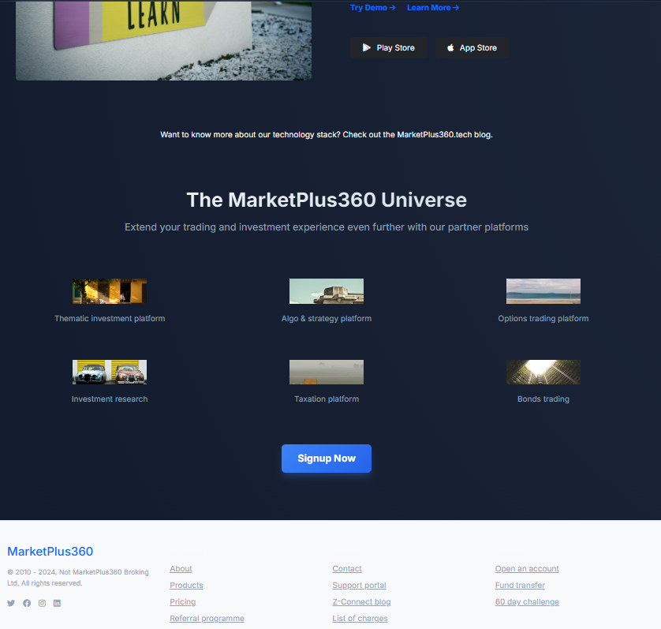
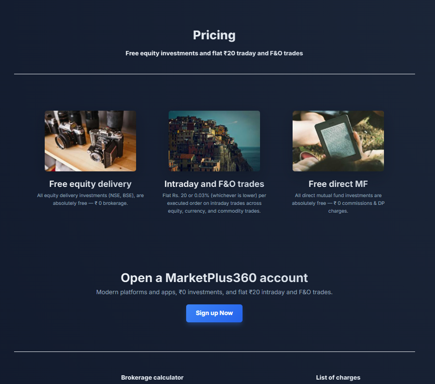
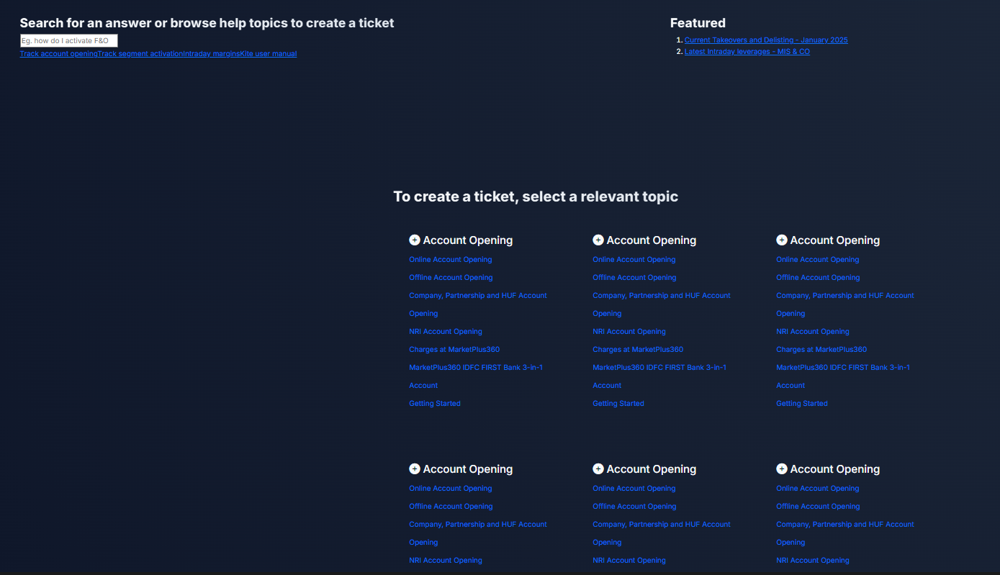
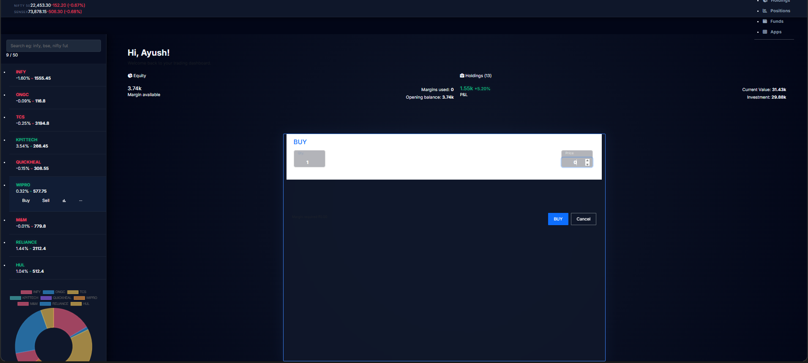

# 🚀 MarketPlus360 - High-Fidelity Trading Ecosystem

MarketPlus360 is a production-grade, full-stack trading platform clone inspired by Zerodha. It features a modernized "Midnight Cyber" dark theme, real-time asset synchronization, and a robust backend integration.

---

## 📸 Platform Preview

| **Midnight Cyber Hero** | **Pro Trading Dashboard** |
|:---:|:---:|
|  |  |
| **Order Execution** | **Holdings Visualizer** |
|  |  |
| **Live Positions** | **Cyber Pricing** |
|  |  |
| **Interactive Signup** | **Product Ecosystem** |
|  |  |

---

## ✨ Key Features

- **Midnight Cyber Dark Theme**: A sophisticated, interactive dark mode with mesh gradients and glassmorphism UI.
- **Full Trading Lifecycle**: Seamlessly place **BUY** and **SELL** orders that instantly synchronize with your **Holdings**, **Positions**, and **Order History**.
- **Modern Landing Page**: High-conversion landing pages for products, pricing, and support with guaranteed external media integration.
- **Dynamic Portfolio Tracking**: Real-time visualization of P&L, current value, and net change.
- **Secure Authentication**: Functional signup flow with mobile number validation and backend persistence.
- **Interactive Watchlist**: Real-time stock search and one-click trade execution layers.

---

## 🛠️ Tech Stack

- **Frontend**: React.js, React Router, Bootstrap 5, Font Awesome 6
- **Dashboard**: React.js, MUI (Material UI), Chart.js
- **Backend**: Node.js, Express.js
- **Database**: MongoDB (Mongoose)

---

## 🚀 Getting Started

### Prerequisites

- Node.js installed
- MongoDB Cluster (Atlas or Local)

### 1. Environment Configuration

Create a `.env` file in the `backend/` directory:

```env
PORT=3005
MONGO_URI=your_mongodb_connection_string
```

> [!NOTE]
> The backend features a **Demo Mode** fallback. If the MongoDB connection fails, it will still allow you to test the signup and order flows using mock persistence.

### 2. Installation & Run

Open three separate terminals:

**Terminal 1: Backend**
```bash
cd backend
npm install
node index.js
```

**Terminal 2: Frontend (Main Site)**
```bash
cd frontend
npm install
npm start
```

**Terminal 3: Dashboard**
```bash
cd dashboard
npm install
$env:PORT=3001; npm start
```

---

## 🌐 Localhost URLs

- **Main Platform**: [http://localhost:3000](http://localhost:3000)
- **Trading Dashboard**: [http://localhost:3001](http://localhost:3001)
- **API Server**: [http://localhost:3005](http://localhost:3005)

---

## 📄 License

This project is for educational purposes. Built with ❤️ for the MarketPlus360 community.
